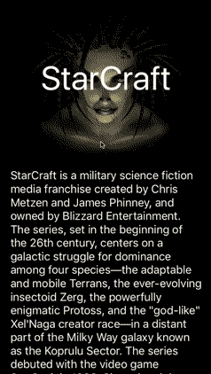
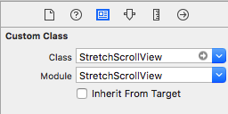
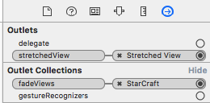
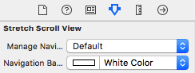
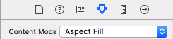
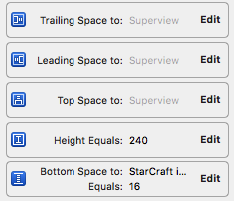
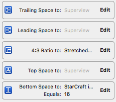

# StretchScrollView

[](https://github.com/Carthage/Carthage)
[](http://cocoapods.org/pods/StretchScrollView)
[](http://cocoapods.org/pods/StretchScrollView)
[](http://cocoapods.org/pods/StretchScrollView)
[](https://travis-ci.org/anton-plebanovich/StretchScrollView)

StretchScrollView provides functionality to enlarge title image and hide overlays when scrolling down. When scrolling up it allows to animate background of navigation bar.

## Example

To run the example project, clone the repo, and run `pod install` from the Example directory first.

## GIF animation



## Installation

#### Carthage

**If you are setting `StretchScrollView` class in storyboard assure module field is also `StretchScrollView`**



Please check [official guide](https://github.com/Carthage/Carthage#if-youre-building-for-ios-tvos-or-watchos)

Cartfile:

```
github "APUtils/StretchScrollView"
```

#### CocoaPods

StretchScrollView is available through [CocoaPods](http://cocoapods.org). To install
it, simply add the following line to your Podfile:

```ruby
pod 'StretchScrollView'
```

## Configuration

Assign `StretchScrollView` class to your UIScrollView in storyboard, **assure module field is also `StretchScrollView`**:


Set needed outlets and options.




Usually content mode `Aspect Fill` fits well for `UIImageView`:



Properly setup constraints for `stretchedView`. There are two resize modes available: by top and height constraints and by top and sides constraints.

Example constraints setups:





```swift
/// StretchScrollView will manage navigation bar transparency by itself.
/// You could disable this option to manage it by yourself or to disable navigation bar animations.
@IBInspectable var manageNavigationBarTransparency: Bool = true

/// In case of transparent navigation bar you may specify background color that will appear when you scroll up.
@IBInspectable var navigationBackgroundColor: UIColor = .clear
```

You are done! See example project for more details.

## Contributions

Any contribution is more than welcome! You can contribute through pull requests and issues on GitHub.

## Author

Anton Plebanovich, anton.plebanovich@gmail.com

## License

StretchScrollView is available under the MIT license. See the LICENSE file for more info.
